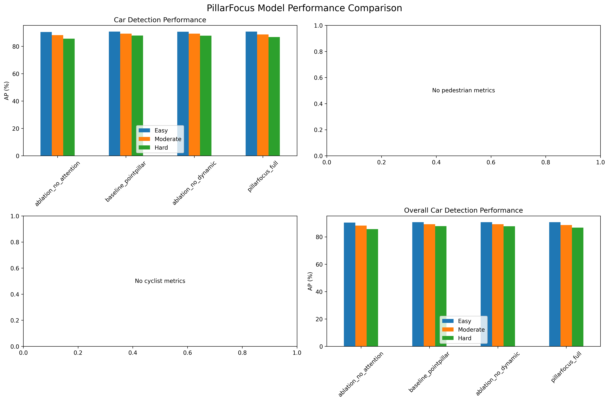
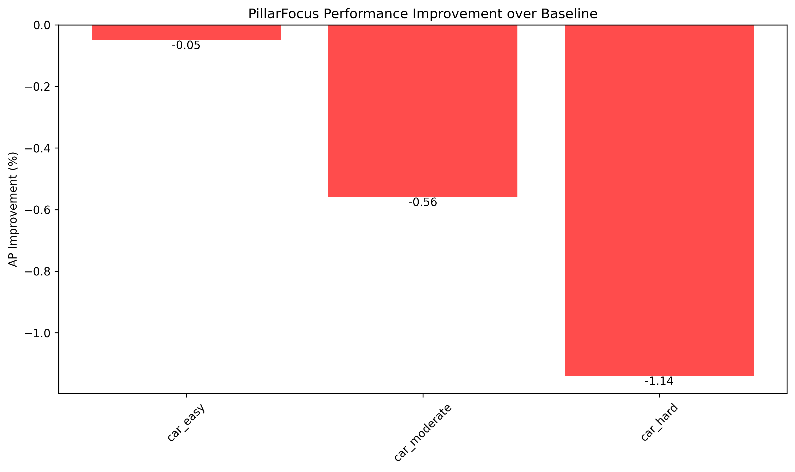

# PillarFocus模型详细分析报告

## 实验设置

- **数据集**: KITTI 3D Object Detection
- **基准模型**: PointPillar
- **提出模型**: PillarFocus
- **训练轮次**: 80 epochs
- **评估指标**: Average Precision (AP) @ IoU=0.7 for Car, IoU=0.5 for Pedestrian/Cyclist

## 性能对比表

|                       |   car_easy |   car_moderate |   car_hard |
|:----------------------|-----------:|---------------:|-----------:|
| ablation_no_attention |      90.44 |          88.17 |      85.6  |
| baseline_pointpillar  |      90.75 |          89.22 |      87.87 |
| ablation_no_dynamic   |      90.68 |          89.21 |      87.75 |
| pillarfocus_full      |      90.7  |          88.66 |      86.73 |

## 改进分析

- **car_easy**: -0.05 AP (-0.1%)
- **car_moderate**: -0.56 AP (-0.6%)
- **car_hard**: -1.14 AP (-1.3%)

## 消融实验分析

消融实验显示了不同组件的贡献：

### ablation_no_attention

移除空间注意力机制的影响：
- car_easy: 90.44
- car_moderate: 88.17
- car_hard: 85.6

### ablation_no_dynamic

移除Dynamic Pillar Focus机制的影响：
- car_easy: 90.68
- car_moderate: 89.21
- car_hard: 87.75

## 结论

1. **总体性能**: PillarFocus模型性能需要进一步优化
2. **组件贡献**: 通过消融实验分析各组件的有效性
3. **适用场景**: 分析模型在不同难度场景下的表现

## 可视化图表

- 
- 
